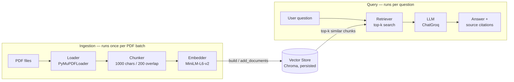

# 📄 Custom PDF Q&A Assistant

A classic Retrieval-Augmented Generation (RAG) system, built from scratch to
learn the pipeline end to end: load PDFs, chunk them, embed them, store them
in a vector database, retrieve the relevant pieces for a question, and ask an
LLM to answer *only* from what was retrieved — with citations back to the
source file and page.

Works with **multiple PDFs at once**, indexed incrementally, with a
[Streamlit](https://streamlit.io/) chat UI on top.

🔗 **Live app:** [custompdfrag.streamlit.app](https://custompdfrag.streamlit.app/)

## How it works

Ingestion and querying are two independent phases that meet at one shared
component — the vector store.



| Stage | What happens | Code |
|---|---|---|
| **Load** | Every PDF under a directory is opened and split into per-page `Document` objects, tagged with the source filename | [`src/rag/loader.py`](src/rag/loader.py) |
| **Chunk** | Pages are split into ~1000-character overlapping chunks so retrieval can be precise | [`src/rag/chunker.py`](src/rag/chunker.py) |
| **Embed & Store** | Each chunk is embedded locally (`sentence-transformers/all-MiniLM-L6-v2`) and persisted to a Chroma collection on disk | [`src/rag/vectorstore.py`](src/rag/vectorstore.py) |
| **Retrieve** | A question is embedded and matched against the store for its top-k nearest chunks | [`src/rag/vectorstore.py`](src/rag/vectorstore.py) |
| **Generate** | The retrieved chunks are stuffed into a prompt that instructs the LLM to answer *only* from that context | [`src/rag/qa_chain.py`](src/rag/qa_chain.py) |
| **Orchestrate** | `RAGPipeline` ties all of the above into `ingest_directory()`, `ingest_files()`, and `ask()` | [`src/rag/pipeline.py`](src/rag/pipeline.py) |

## Tech stack

| Purpose | Tool |
|---|---|
| Orchestration | [LangChain](https://python.langchain.com/) |
| PDF parsing | [PyMuPDF](https://pymupdf.readthedocs.io/) |
| Embeddings | [sentence-transformers](https://www.sbert.net/) (local, free) |
| Vector store | [Chroma](https://www.trychroma.com/) |
| LLM | [Groq](https://groq.com/) (`openai/gpt-oss-120b`) |
| UI | [Streamlit](https://streamlit.io/) |
| Env / deps | [uv](https://docs.astral.sh/uv/) |

## Getting started

**Prerequisites:** Python 3.13, [uv](https://docs.astral.sh/uv/), and a free
[Groq API key](https://console.groq.com/keys).

```bash
# install dependencies
uv sync

# add your Groq API key
cp .env.example .env
# edit .env → GROQ_API_KEY=your-key-here

# run the app
uv run streamlit run app.py
```

The repo ships with two sample PDFs already indexed (`data/pdf/`), so the
assistant is queryable immediately — upload your own PDFs from the sidebar to
add more.

## Usage

1. Open the sidebar and upload one or more PDFs, then click **Process PDFs**.
   Each upload is indexed into the same persistent vector store, so
   previously uploaded PDFs stay searchable.
2. Ask a question in the chat box.
3. Expand **Sources** under any answer to see exactly which file and page the
   model used to ground its response.

## Project structure

```
.
├── app.py                   # Streamlit chat UI
├── src/rag/
│   ├── loader.py             # PDF → Documents (with source metadata)
│   ├── chunker.py            # Documents → overlapping chunks
│   ├── vectorstore.py        # Chunks ↔ Chroma (embed, persist, search)
│   ├── qa_chain.py           # Retrieved chunks + question → grounded answer
│   └── pipeline.py           # RAGPipeline — orchestrates the above
├── notebook/
│   ├── pdfloader.ipynb       # Prototyping: loading, chunking, vector store
│   └── document.ipynb        # Prototyping: document loader exploration
├── data/
│   ├── pdf/                  # Source PDFs (+ uploads/ from the UI)
│   └── vectorstore/           # Persisted Chroma index
└── .env.example               # Expected environment variables
```

## What I learned building this

- **Chunking is a trade-off, not a formula** — smaller chunks retrieve more
  precisely but carry less surrounding context; `RecursiveCharacterTextSplitter`
  cutting on paragraph/line/space boundaries (instead of a hard character cut)
  matters more than the exact chunk size.
- **Embeddings are nearest-neighbor search in meaning-space** — semantic
  similarity, not keyword overlap, is what makes "how do I install Python?"
  match "steps to set up the Python interpreter."
- **The vector store is the hinge of the whole system** — ingestion writes to
  it, querying reads from it; persisting it to disk (rather than rebuilding
  every run) is what makes the assistant "remember" PDFs across restarts.
- **Grounding is mostly prompt discipline** — the single instruction "answer
  using ONLY the context below, say you don't know otherwise" is what keeps
  the assistant from hallucinating when a question isn't covered by the PDFs.
- **Retrieval and generation are cleanly separable** — building `VectorStore`,
  `QAChain`, and `RAGPipeline` as independent classes made it possible to
  swap models (Anthropic/Groq/Gemini/Mistral are all wired as options) without
  touching the retrieval code at all.
- **Streamlit reruns the whole script on every interaction** — anything that
  must survive between interactions (the pipeline, chat history, indexed file
  list) has to live in `st.session_state`, not a plain variable.

📚 Longer write-up with theory + code for each concept:
[RAG Notes](https://claude.ai/code/artifact/c0dcabbe-334d-4b04-97bd-28354f329610)
*(private — share it from the artifact page if you want this link to work for others)*

## Possible next steps

- Streaming responses instead of a single blocking answer
- Multi-turn conversational memory (follow-up questions)
- Hybrid search (keyword + semantic) for exact-term queries
- A retrieval quality eval set to compare chunk sizes / embedding models
